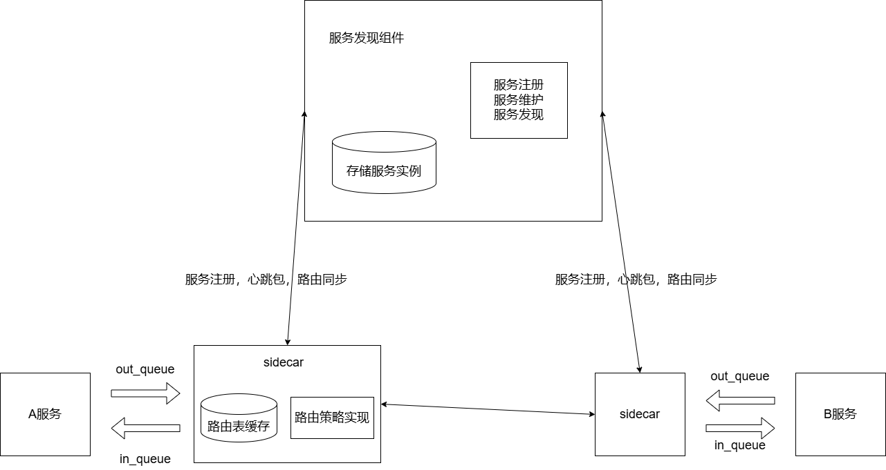

# 项目介绍
实现了一个针对游戏业务的服务网格框架，功能包括服务发现，服务注册，服务保活，支持多种路由策略（指定目标路由、随机路由，一致性哈希，基于权重路由，动态键值路由）
# 在部署前要提前安装
**1. zeroMQ负责通信**  
wget https://github.com/zeromq/cppzmq/archive/master.zip  
unzip master.zip  
cd cppzmq-master  
sudo cp ./zmq.hpp /usr/local/include  

**2. murmurhash3负责一致性哈希**  
sudo yum update  
sudo yum install gcc make  
git clone https://github.com/aappleby/smhasher.git  

**3. protobuf负责序列化**  
[abseil库的安装-Ubuntu18.04_abseil安装-CSDN博客](https://blog.csdn.net/qiuguolu1108/article/details/106445859)  

**4. redis负责存储服务实例**  
sudo dnf install redis  

**5.cpp-redis负责redis**  

# 架构图

# 文件目录
MiniGameRouter/
- **README.md**: 项目说明文件
- **include/**: 包括了服务端点和通信协议的定义
  - **Endpoint.h**: 服务端点
  - **Message.h**: 通信协议
- **namesvr/**: 实现Namesvr
  - **main.cpp**: 主函数，通过一个while循环不断运行
  - **namesvr.cpp**：实现服务发现和注册
  - **namesvr.h**：定义namesvr类
  - **start.sh**：编译脚本
- **protobuf/**: pb序列化
  - **message.proto**
- **sidecar/**: 实现Sidecar，包括路由策略
  - **ConsistentHash/**：实现一致性哈希
    - **ConsistentHash.cpp**：实现虚拟节点，哈希环的初始化，增加和删除节点
    - **ConsistentHash.h**：定义一致性哈希类
  - **main.cpp**：主函数，通过一个while循环不断运行
  - **routing_config.txt**：通过配置文件设置服务之间选取哪种路由策略（随机，权重，一致性哈希）
  - **SideCar.h**：定义Sidecar类
  - **SideCar.cpp**：实现4种路由策略，与Namesvr通信接口，与服务通信接口
  - **start.sh**：编译脚本
- **helper**：方便客户调用的接口实现
  - **helper.h**: 接口实现类
  - **helper.cpp**: 实现各种发送接口和接收接口
- **test**: 测试用例，包括指定目标，动态键值，和其他路由测试
  - **by_ep.cpp**：指定目标路由测试
  - **by_key.cpp**：动态键值测试
  - **by_other.cpp**：其他路由方式测试
  - **test.sh**：编译脚本
  

